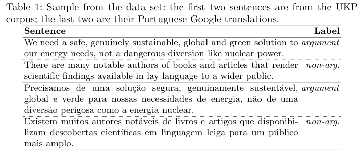
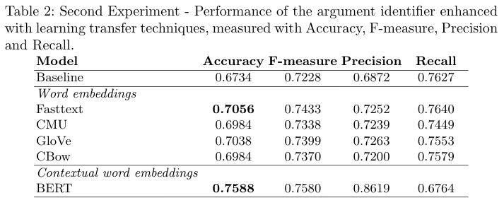
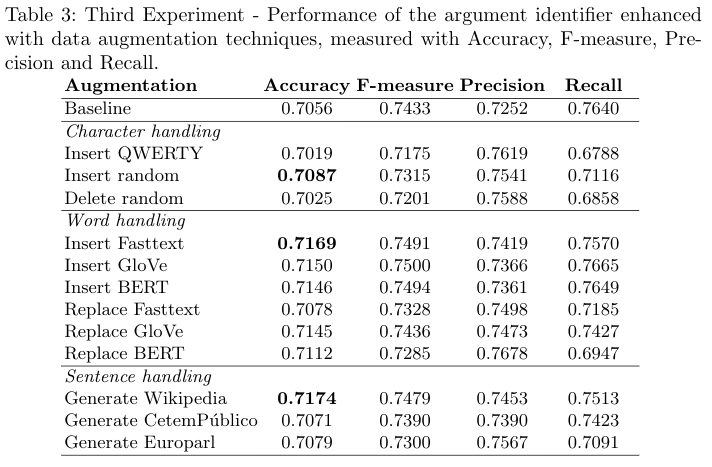

# Argument Identification in a Language without Labeled Data

## Article

**Authors**
```
João Rodrigues and António Branco
```

**Paper**

[Argument Identification in a Language without Labeled Data]()


**Abstract**
> This paper addresses the issue of how to obtain processing tools for argument identification for the vast majority of the languages that, differently from English, have little to no relevant labeled data.

> This issue is addressed by taking an under-resourced language as a case study, namely Portuguese, and by experimenting with three techniques to cope with the scarceness of data: to obtain labelled data by machine translating data sets from another language labelled with respect to argument identification; to transfer to the argument identifier the language knowledge captured in distributional semantic models obtained during the resolution of other tasks for which more data exist; to expand data for argument identification with text augmenting techniques.

> The results obtained demonstrate that it is possible to develop argument identification tools for under-resourced languages with a level of performance that is competitive to the ones for languages with relevant language resources.

## Data sets

The corpus used in the three experiments for Portuguese is obtained from a mainstream data set in English, the [UKP Sentential Argument Mining Corpus](https://www.informatik.tu-darmstadt.de/ukp/research_6/data/argumentation_mining_1/ukp_sentential_argument_mining_corpus/index.en.jsp), which is translated into Portuguese by resorting to Google Translate.
Examples from this data set are presented in Table 1.

The English data set was created by including texts on eight controversial topics in each one of these domains: news, editorials, blogs, debate forums, and encyclopedia articles. 
By taking into account the respective topic, each sentence in the corpus was manually annotated as being an argument or a non-argument.

This corpus has approximately 25k sentences of which 10k are labeled as arguments and 15k as non-arguments.
The definition for argument followed by the annotators was a span of text expressing evidence or reasoning that can be used
to either support or oppose a given topic.

For the Portuguese data set, we adopted the same split proportion as in the original (English) data set, that is, 70% of the total instances for [training](train_pt.tsv), 10% for [development](dev_pt.tsv) and 20% for [testing](test_pt.tsv).

<p align="center">
  
</p>

We evaluated the FastText model on [60 manually reviewed sentences](test_60_pt.tsv) from the test set and obtained a delta of 0.0320 in comparison with the machine translated output.


## Experiments

The [BiLSTM](bilstm_baseline.py) source code for the baseline is available for the reproduction of the results reported in Table 2 and Table 3.

We choose to experiment with semantic spaces of different natures, namely from: 
* (a) [FastText](https://fasttext.cc/), a distributional semantic space that takes morphological
information into account; 
* (b) [multilingual word vectors](https://www.aclweb.org/anthology/P16-1190/), which are jointly
learned embeddings from parallel data; and 
* (c) [GloVe](https://nlp.stanford.edu/projects/glove/) and [word2vec](https://code.google.com/archive/p/word2vec/) models
created with the models from [STIL2017](http://nilc.icmc.usp.br/embeddings) . 

All the distributional semantic models had the same vector size of 300 units.

We also experimented with the transfer of knowledge from a BERT fine-tuned for Portuguese. 
BERT is a bidirectional encoder that learns from the left and right context for each word in a sentence and is trained on two tasks: a mask language task and a sentence prediction task. 

While in the previous distributional semantic models, the neural network has an embedding layer encoding the respective
semantic space, BERT is itself a neural network with the semantic space encoded through several neural network layers.

We fine-tuned a pre-trained multi-language BERT model resorting to [adapters](https://github.com/google-research/adapter-bert).

A higher accuracy value (0.7653) was obtained after the publishing of the paper.
The following parameters were used to obtain it: multi_cased_L-12_H-768_A-12 model with a maximum sequence length of 64, a learning rate of 2e-4, 10 training epochs and batch size of 32.

<p align="center">
  
</p>

<p align="center">
  
</p>
